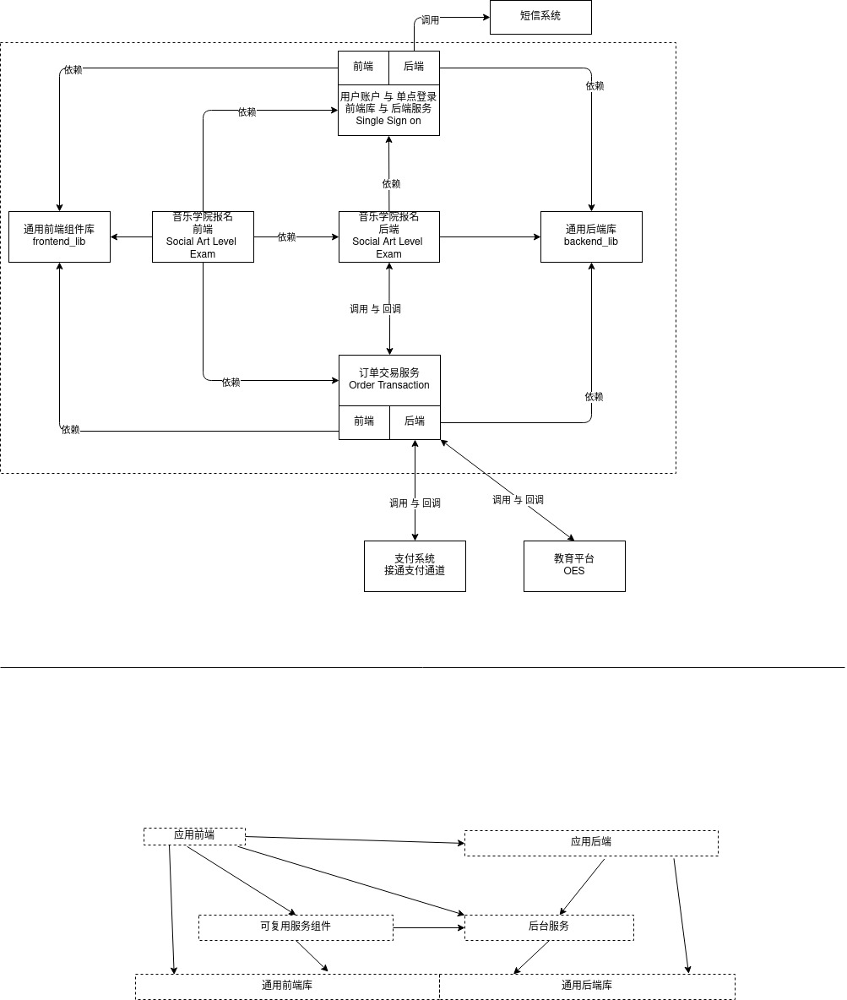

# 系统体系结构

--------------------

## frontend_lib(通用前端组件库)

可被任何项目导入并使用，此库可以 基于第三方开源库 例如MUI 等， 
但不依赖于任何公司其他项目。

## backend_lib(通用后端库)
可以被任何后端服务导入并使用，此库可以 基于第三方开源库，
但不依赖于公司任何其他项目。

## single sign on (用户账户与单点登录)
- 后端： 提供 一系列 用户注册，登录与登出的后台服务，以OpenAPI的接口形式体现。
可以被任何其他系统或者前端远程调用。

- 前端： 提供与后端相匹配的 可复用前端组件，该前端组件可以与后端进行通信，并可以被直接复用和集成到其他系统中。 例如登录组件，注销组件等。可以导入并使用`通用前端组件库`。

## order transaction（订单交易支付）
- 后端： 提供 订单和支付接口， 以OpenApi形式体现。可以被任何其他系统或者前端远程调用。

- 前端： 提供与订单何支付接口相匹配的前端组件。可以导入并使用`通用前端组件库`

## social art level exam(音乐学院报名应用)
一个具体的社会艺术考试报名项目
- 应用前端： 用户界面和流程控制， 根据需要可以依赖于任何前端库和后端服务
- 应用后端： 为前端提供各种资源，根据需要可以依赖于任何任何后端服务

--------------------------

# 任务分配

王博： 订单交易支付系统后端，音乐学院报名项目后端，通用后端库
屈李飞：单点登录后端，通用后端库

高慧： 订单交易支付系统前端，通用前端库
韦玉辰：订单交易支付系统前端，音乐报名系统支付前端，通用前端库
肖本东：音乐学院报名前端，单点登录前端，通用前端库