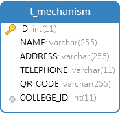
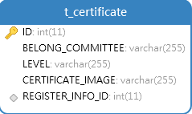

# 数据库表

学院表(t_college) : id，名称，地址，电话，图标

机构表(t_mechanism): id,名称，地址，电话，二维码路径，学院id

水平考试表(t_level_test):id，名称，开始时间，结束时间

账号表(t_account):id，电话，密码

学员表(t_student):id ，名称，名称拼音，证件类型，身份证号，性别，国际，民族，出生，照片，账号id

水平机构学生表(t_level_mechanism_student):水平考试id，机构id，学生id

报名专业表(t_enter_major):id，名称，等级，方式，水平考试id

报名信息表(t_register_info):id，指导人姓名，指导人电话，状态，曲目1，曲目2，曲目3，曲目4，学生id，报名专业id

曲目表(t_track):id, 曲目名称

视频表(t_video):id，视频名称，视频存放的路径，报名信息id，曲目id

证书表(t_certificate):id,所属居委会，等级，证书图片，报名信息id

