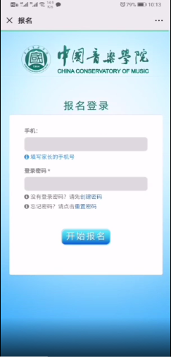
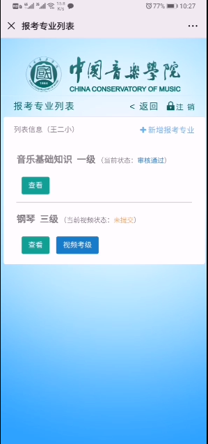

# 网上如何报名

#### 名词定义分析

* 中国音乐学院图标：中国音乐学院的徽标，一个图片

* 中国音乐学院：一所具体的音乐学院，名称为中国音乐学院

* 地址：中国音乐学院所在地

* 联系电话：中国音乐学院的联系电话

* 国音堂001：一个以国音为研究对象的常设机构，是中国音乐学院的一个下属机构

* 二维码：国音堂001对应的报名页面的url链接地址

#### 名词关系分析

* 中国音乐学院（地址，联系电话，中国音乐学院图标）： 

  > > 中国音乐学院是一个 个体名词，还可能有上海音乐学院，北京音乐学院等，其对应的集合名词为`音乐学院`,中国音乐学院只是众多音乐学院中的一个

* 国音堂001（二维码）

  > > 国音堂001 是一个个体名词，它是中国音乐学院的`一个`报名机构，还可能有其他的报名机构 例如国音堂002，那么他们都是`报名机构`中的个体

* 中国音乐学院 可以下设多个类似 国音堂001，国音堂002 的机构，而一个国音堂001却只能隶属于某个特定的中国音乐学院

#### 名词定义与关系总结
* 音乐学院(名称，地址，联系电话，徽标)

  > > 个例： 中国音乐学院，北京音乐学院等

* 报名机构(名称)

  > > 个例： 国音堂001, 国音堂002等
  > > 注意，如果国音堂 可以为多个水平考试报名，那么二维码不应该属于报名机构，而是共同属于 报名机构和社会考试的关联

* 音乐学院 与 报名机构

  > > 一个具体的音乐学院（例如：中国音乐学院）下设有多个报名机构，而一个具体的报名机构(例如：国音堂001)则只能隶属于一个具体的学院
  > > 
  > > 音乐学院 : 报名机构  ==  1 : n

#### 导航分析 

* 操作： 长按二维码，结果： 跳转到报名页面

-------------

#### 名词定义分析

* 全国社会艺术水平考级： 考试，目的为了评定学生的水平等级

* 报名倒计时：报名结束的剩余时间，该时间应该是根据截止时间计算而来

* 中国音乐学院： 一个具体的音乐学院

* 国音堂001： 一个具体的报名机构

#### 名词关系分析

* 全国社会艺术水平考试(报名开始时间，报名截止时间)

  > > 全国社会艺术水平考级 应该有报名的开始和截止时间，它是一个 个体名词，可能还有其他类似的 `水平考试`

* 全国社会艺术水平考试 与 国音堂001 关系

  > > 全国社会艺术水平考试 只能在 国音堂001报名，还是也可在其他 报名机构报名？
  > > 国音堂001  只负责 这一个 全国社会艺术水平考试的报名 还是 也可负责其他水平考试的报名？除了报名，非在线考试是否在此处进行？

#### 名词定义与关系总结
* 水平考试(名称，报名开始时间，报名结束时间)

  > > 个例： 全国社会艺术水平考试

* 水平考试 与 报名机构

  > > 一个具体的水平考试，例如 全国社会艺术水平考试， 可以在多个报名机构报名，比如可以在 国音堂001，国音堂002...等报名机构报名，
  > > 一个具体的报名机构也可以同时承担多个水平考试的报名工作，例如, 国音堂001可以承担全国社会艺术水平考试，也可以承担其他水平考试
  > >
  > > 水平考试 : 报名机构 ==  m : n
  > > 水平考试 与 报名机构中 会关联二维码

* 水平考试 与 音乐学院

  > > 似乎他们有关系，但实际上，他们之间的关系是通过报名机构来维系的
  > > 因为水平考试已经 和 报名机构产生的关联，而报名机构隶属于音乐学院，所以水平考试与音乐学院已经产生了间接关联
  > > 知道一个的水平考试，可以找到相关的报名机构，从而找到所属音乐学院，反之，知道一个具体的音乐学院，可以找到所有下设报名机构
  > > 从而找到相关的水平考试

#### 导航分析 

* 操作：点击`报名按钮` 结果：跳转到报名登录页面

-------------

#### 名词定义分析

* 中国音乐学院：
* 家长：报考学员的家长

* 手机：手机号码

* 登录密码：登陆时安全验证信息

#### 名词关系分析

* 家长 与 音乐学院

  > > 从现实世界，家长与音乐学院并无直接关联，但我们隐约觉得家长和音乐学院似乎并非完全孤立，其原因在于家长的小孩（后面的学员）和音乐学院产生的直接或者间接的联系，另外，现实生活中，家长需要和报名机构联系处理报名事宜，似乎家长和报名机构会产生联系，而报名机构隶属于音乐学院，所以家长与音乐学院也产生间接关系

* 家长 与 报名机构

  > > 家长 与 报名机构的关系，只有当家长的小孩在该报名机构报名后，两者才产生关联，所以家长和报名机构的关系暂时不考虑在内

#### 名词定义与关系总结
* 账号（手机号码，登录密码）

  > > 账号是用于登录系统的凭证，在系统中表现为家长的概念，但目前我们暂时决定该账号与音乐学院 和 报名机构无直接联系

#### 导航分析 

* 操作：点击`创建密码`链接，弹框"请输入登录密码"，填写密码后点击确认按钮自动关闭弹框

  > > 此处似乎有问题，创建密码 如果没有验证码的话，岂不是任何人都可以给任何一部手机创建密码？

* 操作：点击 `重置密码`链接 结果：导航到重置密码页面

#### 导航分析 

* 操作：输入手机号和登陆密码，点击开始报名按钮           结果：如手机号和密码匹配，导航到学院列表页面

-------------

#### 名词定义分析

- 中国音乐学院：
- 学员列表：当前账号下所有学员

#### 名词关系分析

- 学员 和 账号 的关系

  > > 一个账号下面可以添加多个学员，表明了一个账号可以对应多个学员，而一个学员只能隶属于一个账号

- 学员 和 报名机构

  > > 学员和报名机构最直观的是一个报名的关系，例如某学员在某报名机构报名，
  > > 一个直观的问题是，一个学员是否可以在多个报名机构报名, 一个报名机构是否可以接受多个学员的报名？
  > > 什么是报名，报什么名？ 对这个问题，我们说是某个考试的报名，所以报名的含义通常是指 某人在某机构对某个考试 报名

#### 名词定义与关系总结
- 学员（属性目前不清楚）

- 学员 与 账号
- 学员与报名机构

  > > 一个报名机构显然可以接受多个学员的报名，但是一个学员是否可以再多个报名机构报名
  > >
  > > 学员:报名机构 == m:n

- 学员与水平考试

  > > 一个学员可以报名多个水平考试，而一个水平考试也可以接受多个学员的报名
  > >
  > >  学员：水平考试 == m:n 

#### 导航分析 

* 操作：点击学员按钮             结果：导航到创建学员页面

* 操作：点击修改密码按钮     结果：导航到修改密码页面
* 操作：点击注销链接             结果：注销跳转到首页

-------------

#### 名词定义分析

- 中国音乐学院：
- 学员：

- 学员姓名：报考学员的姓名
- 学员姓名拼音：学员姓名的拼音拼写
- 证件类型：在报考时可以提供的证件，可以选择身份证、户口本、护照、港澳台身份证
- 身份证号码：学员的唯一标识
- 性别：学员性别
- 国籍：学员国籍
- 民族：学员民族
- 出生：学员出生
- 照片：学员照片

#### 名词关系分析

- 中国音乐学院

- 学员（学员姓名，学员姓名拼音，证件类型，身份证号码，性别，国籍，民族，出生，照片）

  > > 学员是一个集合名词

#### 导航分析 

* 操作：点击返回链接    	结果：跳转到上一页报名页面
* 操作：点击上传个人两寸彩照按钮          结果：出现选择照片的页面
* 操作：点击提交按钮               结果：跳转到已完成添加当前学员的学员列表页面
* 操作：点击返回按钮          结果：跳转到未添加当前学员信息的学员列表页面

-------------

#### 导航分析 

* 操作：点击申请报考按钮     	结果：点击申请报考跳转到报考专业列表页面
* 操作：点击修改链接             结果：点击修改跳转到修改信息页面

-------------

#### 名词定义分析

- 报考专业：此处无法确定，参看后续定义

#### 名词关系分析

- 报考专业与学员

  > > 一个学员可以报考多个专业，一个专业也可接受多个学员进行报考
  > >
  > > 报考专业：学员 == m:n

- 报考专业 与 音乐学院

  > > 我们认为没有 直接关联

- 报考专业与 水平考试

  > > 根据界面信息，报考专业类似于钢琴，手风琴等，那么该报考专业究竟由什么决定，是有音乐学院，报名机构还是水平考试？
  > > 我们分析认为，此处应该是水平考试对应的报考专业，而和音乐学院的专业无关。
  > > 一个水平考试可以包含多个报考专业，一个报考专业只隶属于一个水平考试
  > >
  > > 水平考试:报考专业 == 1:n

#### 名词定义与关系总结
 - 报考专业（属性无法确定）

 - 报考专业与学员

   > > 一个报考专业接受多个学员，一个学员可以报考多个报考专业
   > >
   > > 报考专业:学员 == m:n

 - 报考专业与水平考试

   > > 每个水平考试都有多个自己的报考专业，每一个报考专业都隶属于一个水平考试，
   > > 注意即便两个水平考试中的报考专业名称相同，我们仍然认为两个专业是不同的报考专业
   > >
   > > 报考专业：水平考试 == n：1

-------------

#### 导航分析 

* 操作：点击返回链接            结果：点击返回跳转到学员列表页面
* 操作： 点击新增报考专业      结果：点击新增报考专业按钮跳转到填写报名资料页面

#### 名词定义分析

- 报考专业信息：
- 专业名称：需要报考的专业名称
- 报考级别：报考的级别
- 考试方式：分为现场考试和视频考试
- 指导老师姓名：指导老师个人信息
- 指导老师电话：指导老师个人信息
- 考试曲目1-4：报考曲目的名称，最少填两个
- 获得时间：证书获得的时间
- 所属考级委员会：所获证书的委员会名称
- 所属专业名称：证书的专业名称
- 获得级别：证书的级别
- 证书照片：所获证书的图片

#### 名词关系分析

- 报名专业（专业、可选报考级别）
  
  > > 报名专业已经和水平考试产生关联
  
- （学员，报名专业）与（考试方式，指导老师姓名，指导老师电话，考试曲目，专业证书）

  > > 考试方式，指导老师姓名，电话这些属性附加在 报名专业 上并不合适，这些属性并不是报考专业的固有属性，
  > > 只有当学员何报考专业发生关联的时候，这些属性信息才有意义
  > > 单纯的说报名专业的指导老师姓名 是没有意义的，我们需要说的是 某个学员报考的某个专业的指导老师姓名，
  > > 这里无法绕开学员的信息
  > >
  > > 这些信息共同组合成 `学员报考信息`

- 专业证书（获得时间、所属考级委员会、所属专业名称、获得级别、证书照片、音乐基础证书）

  > > 某个专业证书是个体名词，其对应集合为专业证书

- 曲目(曲目名称)

#### 名词定义与关系总结
* 报名专业（专业名，可选级别，可选考试方式）

  > > 例如： 钢琴， 可选级别为（1到10级）

* (学员，报名专业)(考试方式，指导老师姓名，指导老师电话，考试曲目，专业证书)

  > > 例如：王二小 报考 钢琴，她采用视频考试，她报考专业的老师是 张大牛 等

* 学员报考信息 和 专业证书的关系

  > > 一条学员报考信息下可以添加多个专业证书
  > >
  > > 学员报考信息：专业证书=1:n

* 曲目 和 学员报考信息 的关系

  > > 一个曲目可以被多条学员报考信息所使用
  > >
  > > 一条学员信息也可以有多个曲目
  > >
  > > 在添加曲目时需要注意判断之前是否已经添加过，已经添加过的应该使用之前添加的曲目信息
  > >
  > > 曲目：学员报考信息=m:n

#### 导航分析 

* 操作：点击选择专业下拉框         结果：弹出选择专业下拉框
* 操作：点击报考级别下拉框         结果：弹出选择报考级别的下拉框
* 操作：点击考试方式下拉框         结果：弹出选择考试方式下拉框
* 操作：点击获得时间                     结果：弹出时间选择列表
* 操作：点击获得级别下拉框         结果：弹出级别选择列表
* 操作：点击图片上传                     结果：选择图片选择页面
* 操作：点击提交按钮                     结果：跳转到报考专业列表页面

-------------

#### 名词定义分析

- 当前状态：学员报考信息的审核进度

#### 名词关系分析

- 学员报考信息 （审核状态）

#### 导航分析 

* 操作：点击查看按钮          结果：跳转到查看报名资料页面
* 操作：点击修改按钮          结果：跳转到修改报名资料页面
* 操作：点击申请审核          结果：弹出确定审核确认框
* 操作：点击确认按钮          结果：确认审核，关闭弹框，改变当前状态
* 操作：点击取消按钮          结果：申请审核，关闭弹框

#### 导航分析 

* 操作：点击成绩查询按钮                     结果：查看当前报考专业的考试成绩
* 操作：点击下载报名表按钮                     结果：下载报考专业需要填写的报名表

***

# 如何提交视频

#### 名词定义分析

- 当前视频状态：当考试方式为视频考试时，上传的的视频的状态

#### 名词关系分析

- 学员报考信息（当前视频状态）

  > > 只有在选择了考试方式为视频考试，才会有视频状态以及视频考级按钮

#### 导航分析 

* 操作：点击视频考级按钮               结果：跳转到视频考级页面

-------------

#### 名词定义分析

* 曲目：考试所需要的曲目
* 曲目视频：考试曲目对应的视频
* 上传说明：在上传视频时所需要注意的事项

#### 名词关系分析

- 学员报考信息（曲目视频）

  > > 在上传视频时需要上传的数量，应该和填写报考信息时填写的考试曲目信息数量相对应

#### 名词定义与关系总结

* 学员报考信息 和 曲目视频 的关系

  > > 一条学员报考信息有多个曲目视频
  > >
  > > 一个曲目视频对应一个学员报考信息
  > >
  > > 学员报考信息：曲目视频=1：n

#### 导航分析 

* 操作：点击上传视频按钮		结果：弹出选择视频文件页面
* 操作：点击上传说明		结果：弹出上传说明页面
* 操作：点击我以阅读上传说明单选框		结果：未勾选提醒用户未勾选
* 操作：点击提交视频按钮		结果：提醒用户上传成功，跳转到报考专业列表页面

****

上传成功后报考专业列表页面下视频考级按钮消失，当前视频状态改变