# 界面流程设计

#### 用户操作引发的系统执行流程 
* 用户操作： 用户长按二维码
* 系统执行:
  1. 系统识别二维码信息跳转到报名页面 如下图:
  2. 跳转后 加载特定信息，用户可以继续操作
-------------

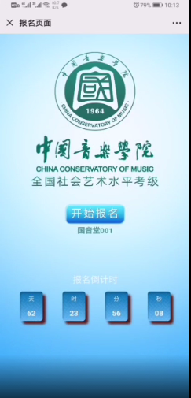
#### 用户操作引发的系统执行流程 
* 用户操作: 单击开始报名
* 系统执行:
  1. 系统跳转到具体的报名登陆界面  如下图:
  2. 跳转后 加载特定信息用户，可以继续操作
-------------

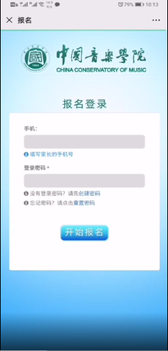

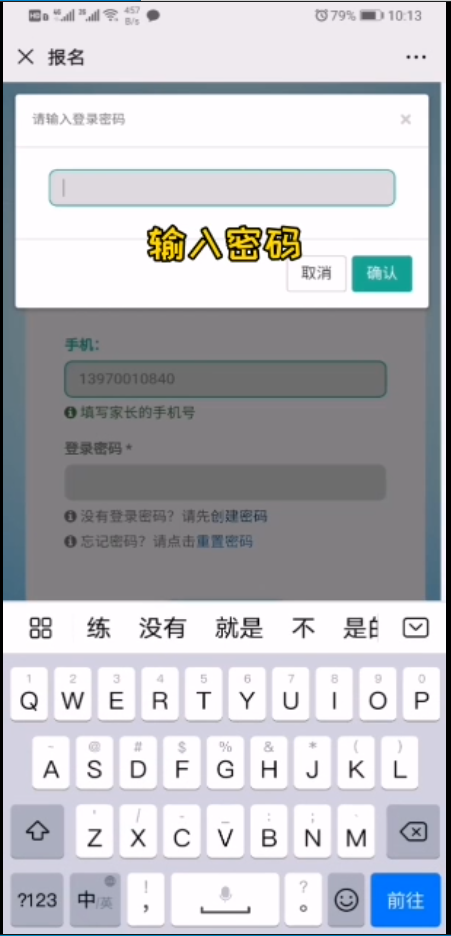

#### 用户操作引发的系统执行流程  

* 用户操作1：

  1. 填写手机号

  2. 点击创建密码

  3. 输入登录密码

  4. 点击确认

* 系统执行2：

  1. 向后端发送手机号及密码
  2. 存在时提示用户手机号已注册
  3. 注册成功关闭创建密码弹出框

*****

* 用户操作2:
  1. 填写家长手机号
  2. 填写登陆
  3. 点击开始报名
* 系统执行2:
  1. 手机号和密码正确时跳转到学院列表页面
  2. 手机号不存在或者手机号和密码不匹配时提示账号或密码错误并清除密码框

---------

#### 用户操作引发的系统执行流程 
* 用户操作
    1. 点击修改密码
* 系统执行
    1. 根据当前账号，让用户输入原密码，新密码后，前端判断新旧密码是否相同给出提示。
    点击修改按钮后；账号密码去匹配是否有一条数据，后端直接对数据的合理性进行相应处理，前端根据返回值提示用户原密码错误或是修改成功。   
-------------
* 用户操作1
    1. 点击注销
* 系统执行1
    1. 结束当前程序，一切前端保存的数据清空
-------------
* 用户操作2
    1. 点击新增学员
* 系统执行2
    1. 显示创建学员界面

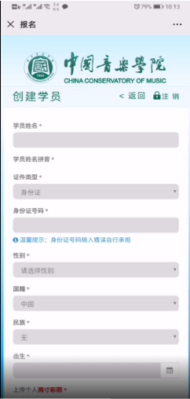
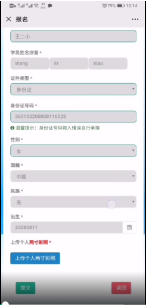
#### 用户操作引发的系统执行流程 
* 用户操作
    1. 输入姓名，选择证件类型，填写证件号码，选择性别，选择国籍，选择名族，选择出生
* 系统执行
    1. 填写证件号码后，对基本长度及数字进行前端校验，同时给出相应提示
-----------
* 用户操作
    1. 点击上传个人两寸彩照
* 系统执行
    1. 弹框让用户选择相应格式的彩照，确定后对照片后缀判断是否支持
-----------
* 用户操作
    1. 点击提交
* 系统执行
    1. 前端继续校验必填项是否完整，不完整：给出提示信息
    完整：前端收集表单数据发送给后端，后端进行对应操作，前端跳转至学员列表页，刷新数据，查看当前账号下的学员列表

#### 用户操作引发的系统执行流程 
* 用户操作
    1. 点击申请报考
* 系统执行
    1. 跳转到报考专业列表信息下，根据当前账号查询该账号下所有学员的报考专业信息
-----------

#### 用户操作引发的系统执行流程 
* 用户操作
    1. 点击新增报考专业
* 系统执行
    1. 跳转到填写报名资料界面，同时传递一个报考人的唯一标识
-----------

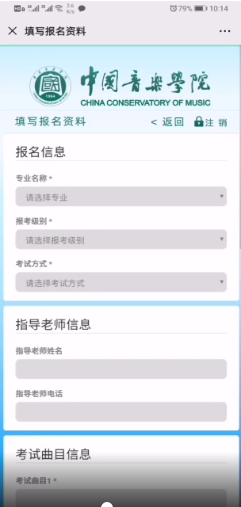
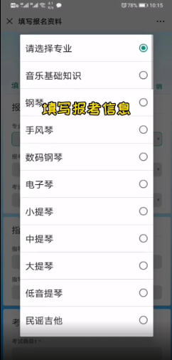

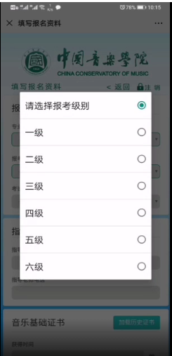
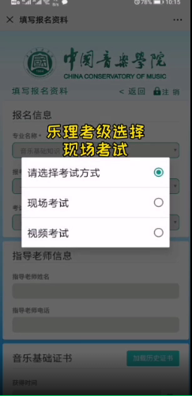
* 用户操作
    1. 必选项：选择专业，选择报考级别，选择考试方式，两首当前专业的考试曲目
    可选：指导老师信息，钢琴证书信息
* 系统执行
    1. 当报考方式为视频考试时
----------

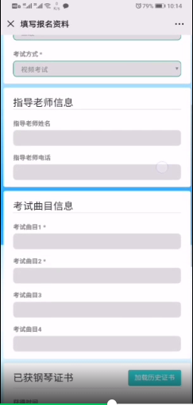
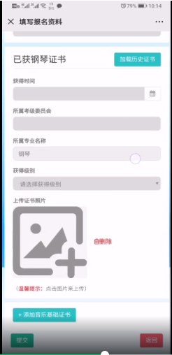
#### 用户操作引发的系统执行流程 
* 用户操作
    1. 点击提交
* 系统执行
    1. 前端验证，必选项是否输入或选择合理，不合理：提示用户
    合理：收集数据，发送后端进行处理，前端跳转到报考专业列表界面，刷新数据
-------------

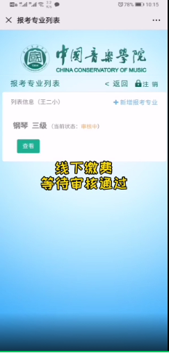

#### 用户操作引发的系统执行流程 
* 用户操作1
    
    1. 点击查看
* 系统执行1
    1. 跳转产看报名资料界面，同时传递当前报考资料信息 或者传递一个主键查询。如下图

    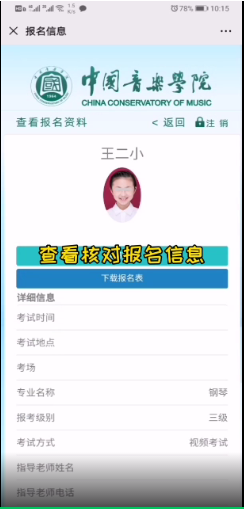
    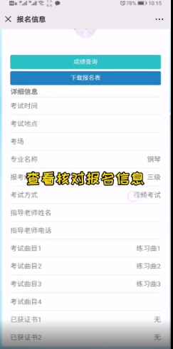
    * 用户操作
        1. 点击成绩查询，点击下载报名表
    * 系统执行
        1. 根据当前报考信息唯一标识向后端请求数据，展示
        2. 下载规定格式的报名表
--------
* 用户操作2
    1. 点击修改
* 系统执行2
    1. 跳转到修改界面 类型填写报名资料界面
-----------
* 用户操作3
    
    1. 点击申请审核
* 系统执行3
    1. 弹出提示框，等待用户后续操作；
    确定：像后端发送请求；参数：当前报考专业信息唯一标识；操作：修改当前报考信息的审核状态。
    回到当前界面，刷新数据
    
    
    
-----------

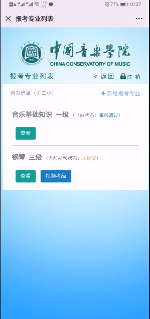
* 用户操作4
    1. 点击视频考级时
* 系统执行4
    1. 跳转到视频考级界面，参数：当前报考专业的唯一标识，到后端查到这个视频考级的曲目信息数量并返回，显示在视频考级界面。如下图：
----------
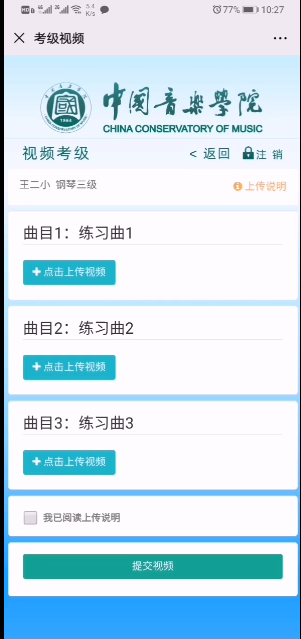
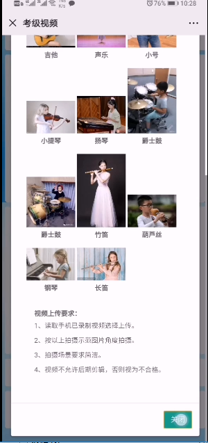
#### 用户操作引发的系统执行流程 
* 用户操作
    1. 点击上传视频
    2. 上传说明
    3. 勾选 ”我已阅读上传说明“
    4. 点击提交视频
* 系统执行
    1. 弹出框，选择合适的视频上传
    2. 显示上传说明界面
    4. 验证相对曲目视频是否已经选择了视频，是否勾选协议
    已选择：开始上传，完成后报考专业列表页面下视频考级按钮消失，当前视频状态改变。

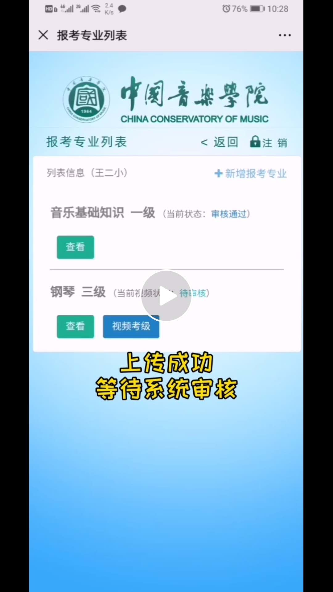
