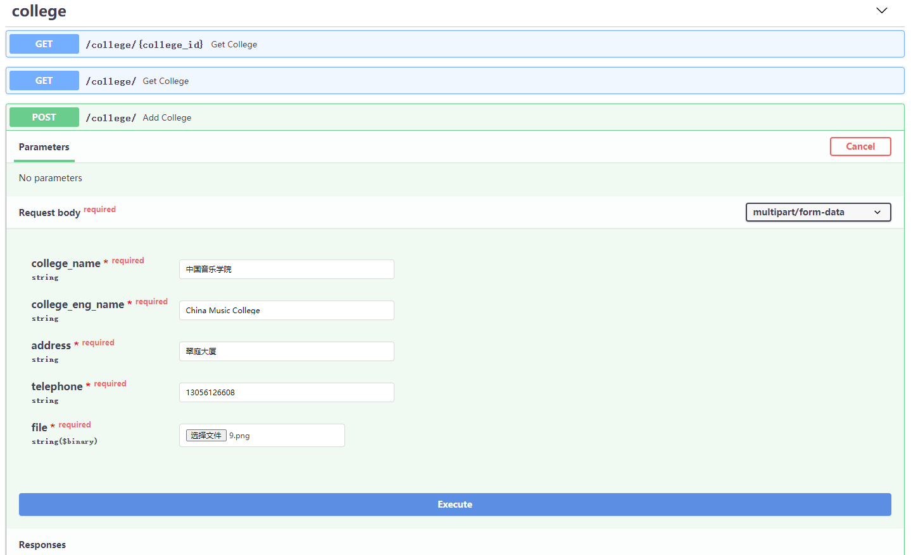
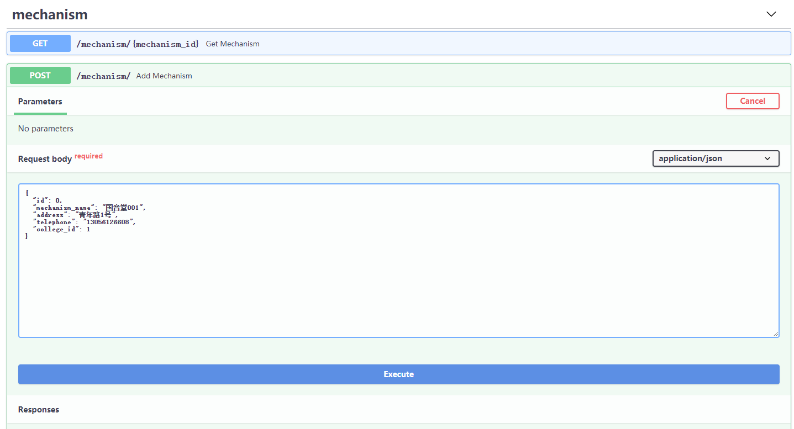
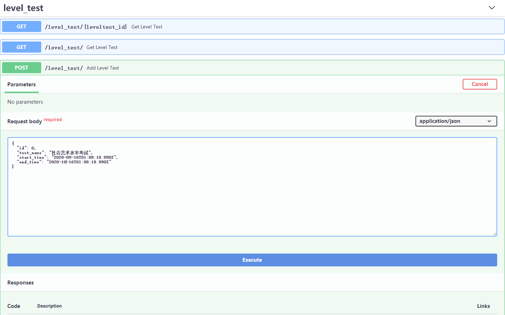
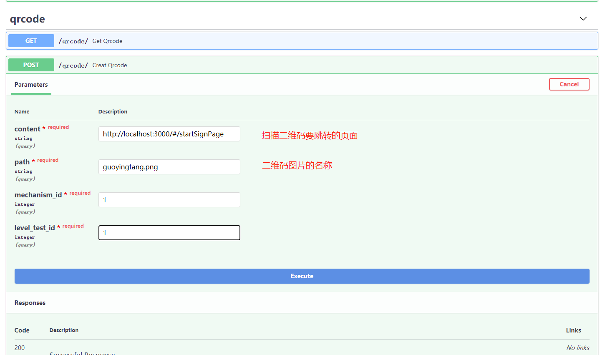
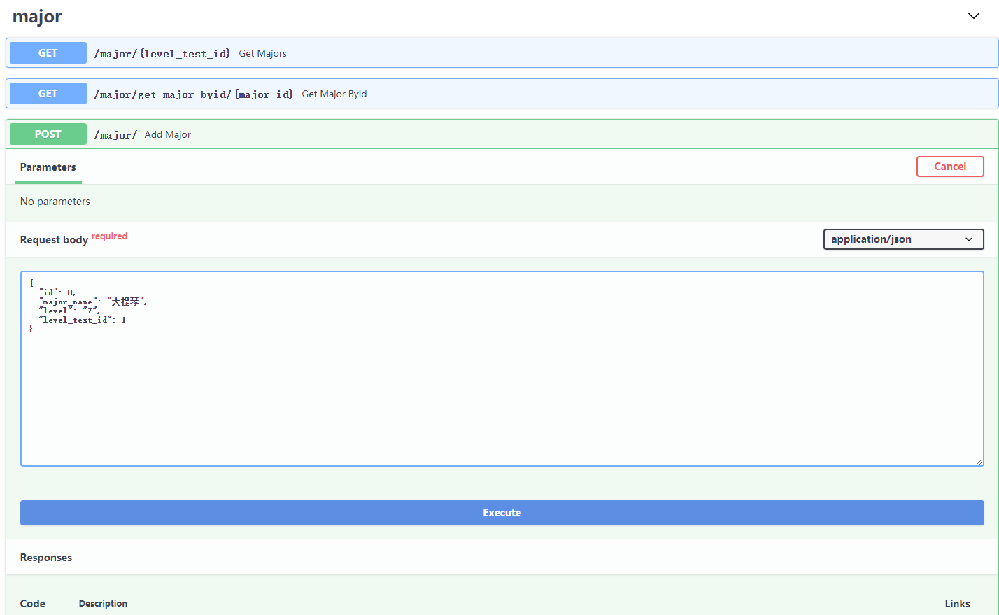
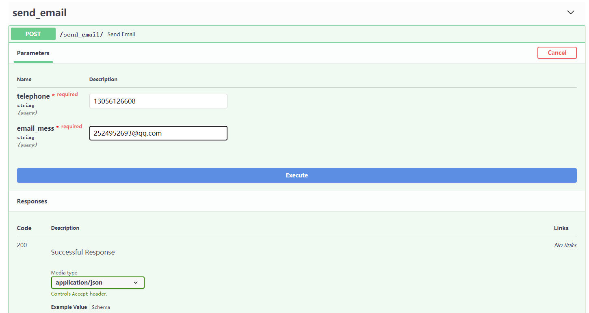
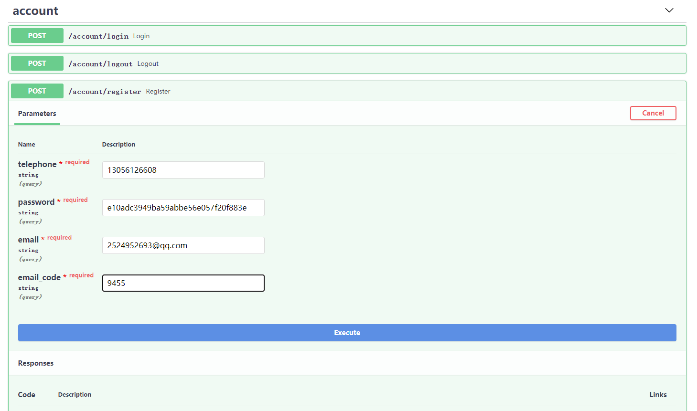
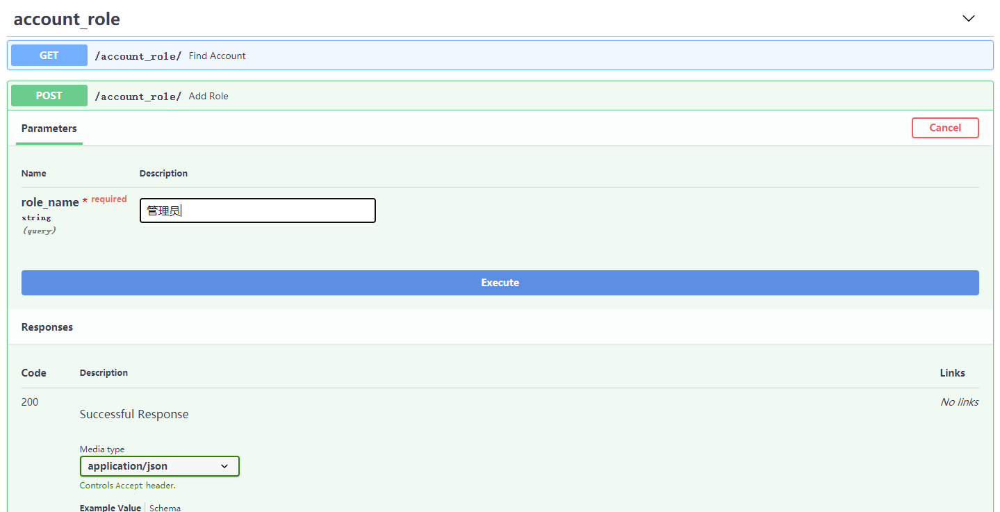
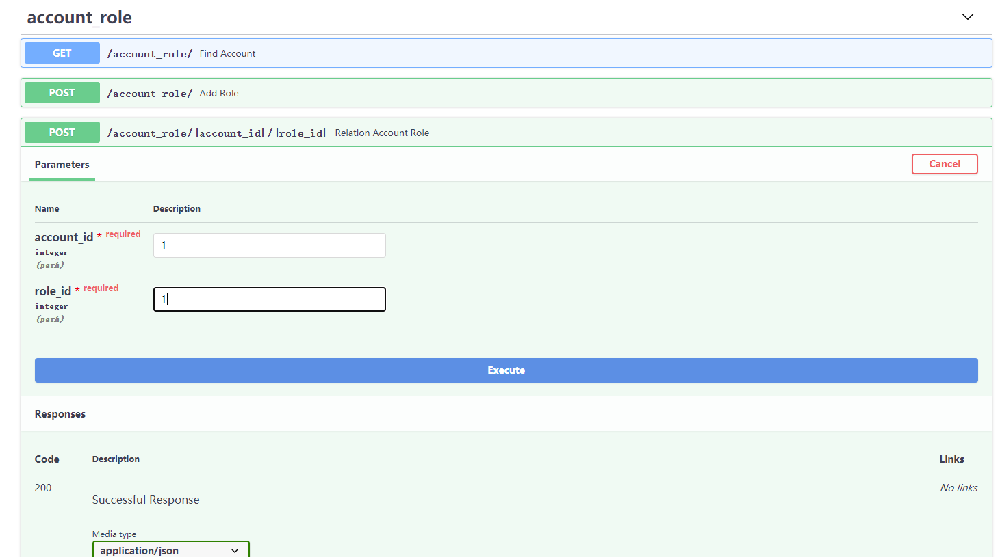

### 初始化数据

1. 添加学院信息

   

2. 添加机构信息(**id 不用填写**)

   

3. 添加水平考试信息

   

4. 添加水平考试和机构的二维码

   

5. 添加专业信息（可以添加多个专业）

   

6. 注册一个账号（可以在fastapi接口注册，也可以在页面注册）

   （1）先发邮件

   ​			

   （2）注册账号

   

7. 添加管理员角色（填完完成，返回了角色对象，拿到管理员的id）

   先添加普通用户，再添加管理员

   

8. 为这个账号赋予管理员角色（account_id是注册账号的id，role_id是注册角色的id）

   管理员角色id为2，普通用户角色id为1

   管理员账号角色id必须为2

   